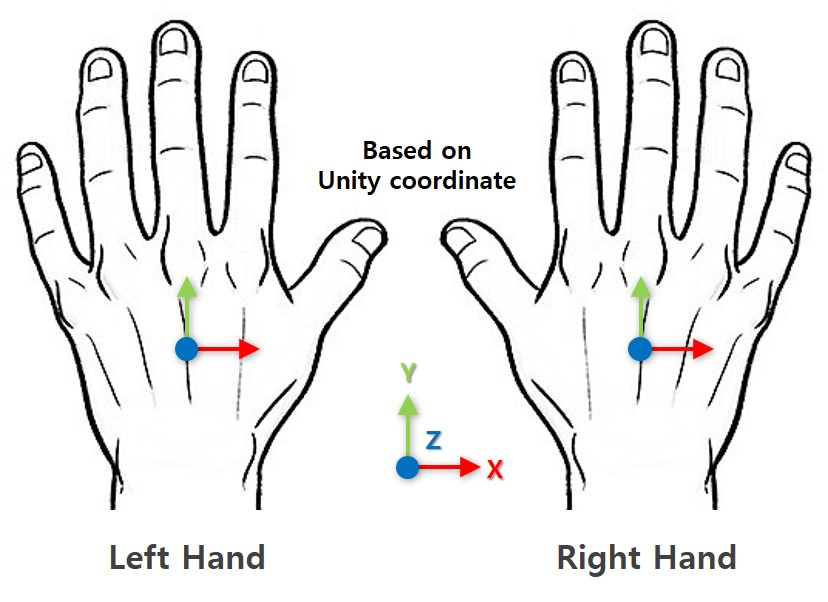
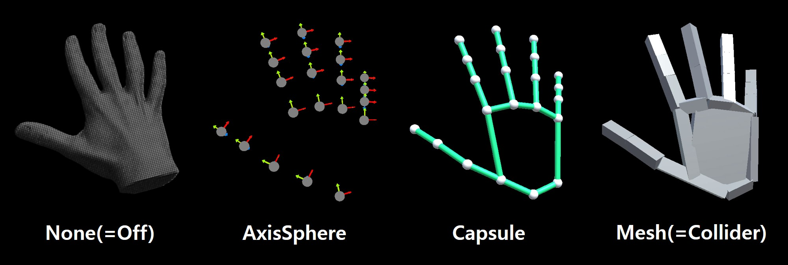
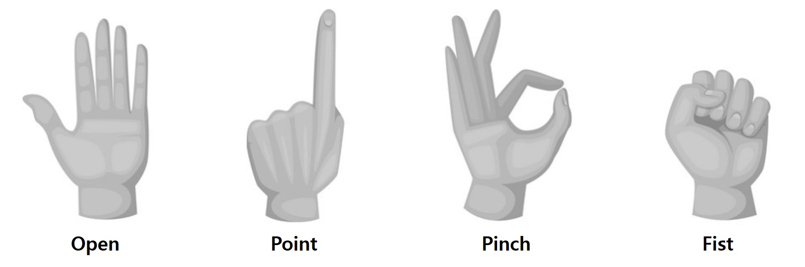
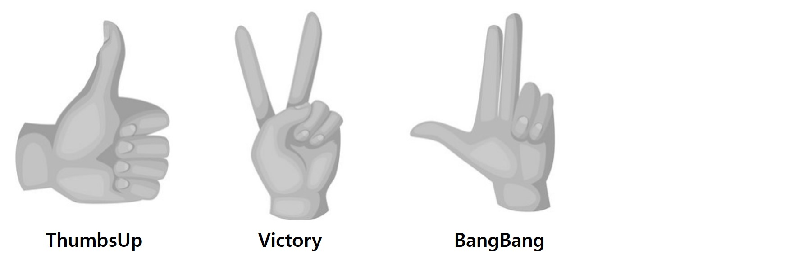
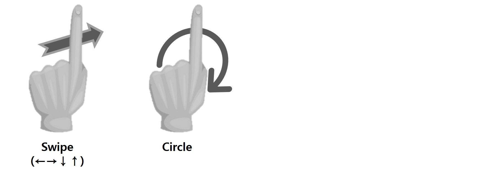
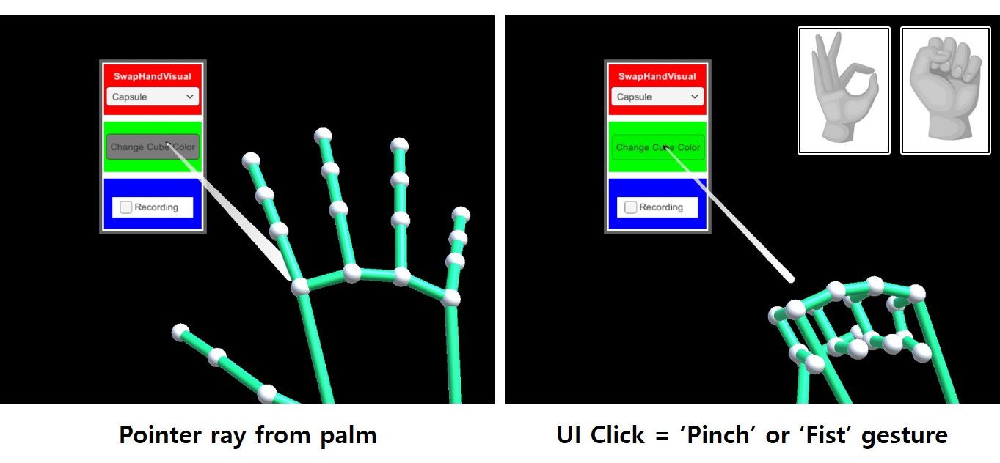
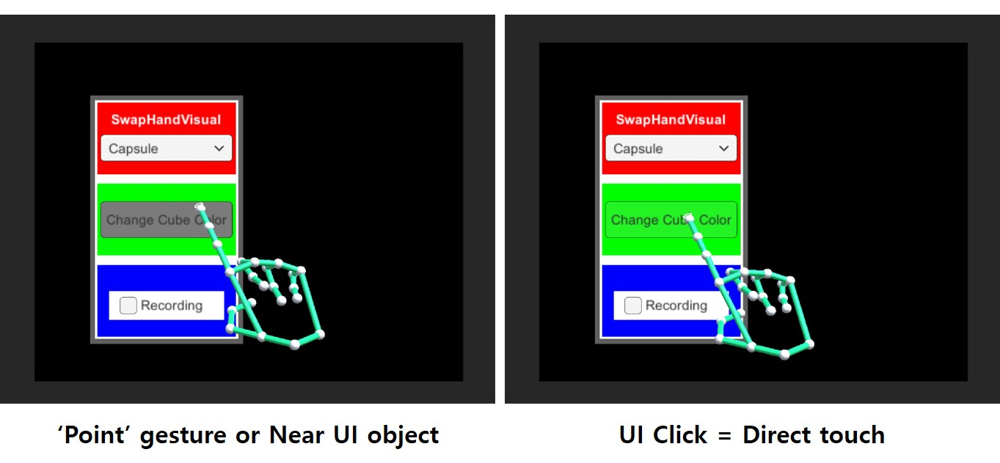
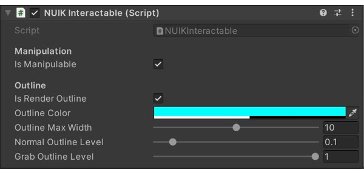
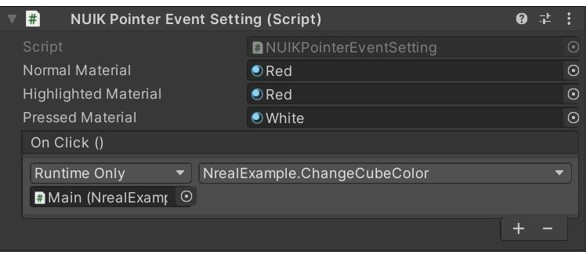
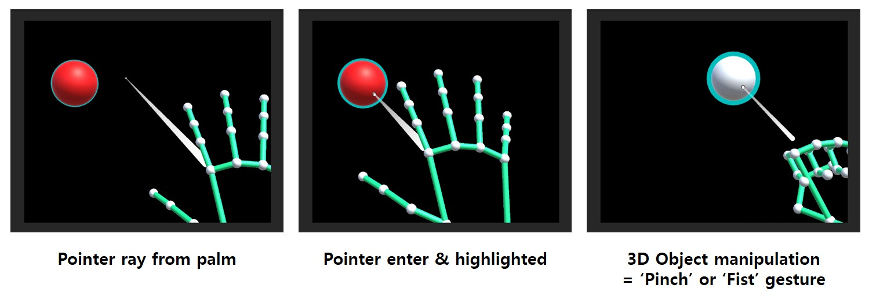

# :wave: Welcome to NUIK

> **for Nreal Light** :eyeglasses:
>
> **Version 0.2.29** :triangular_flag_on_post:
>
> **Last modified : 2021.11.11.** :pencil2:


**Natural User Interface Kit (NUIK)** 는 Unity 기반 핸드 인터랙션 앱 개발을 지원하는 ETRI 주도 프로젝트입니다.

기능은 아래와 같습니다 :

* 웹캠, 스마트폰, AR 헤드셋 등 다양한 RGB 카메라의 영상을 입력으로 받습니다.
* 단일 RGB 영상만을 이용하여 사용자의 3차원 손 자세를 추정합니다.
* 디바이스 설정에 맞춰 자세 추정 결과를 디스플레이에 증강합니다.
* 제스처 인식 및 손을 이용한 Unity UI 및 3D Object 조작을 지원합니다.


# :bookmark_tabs: 목차 

* [패키지 설치](#패키지-설치)
* [시작하기](#시작하기)
* [기능](#기능)
  * [손 데이터 획득](#손-데이터-획득)
  * [손 시각화](#손-시각화)
  * [제스처 인식](#제스처-인식)
  * [UI 인터랙션](#UI-인터랙션)
  * [3D Object 인터랙션](#3D-Object-인터랙션)
  * [포인터 데이터 접근 및 설정](#포인터-데이터-접근-및-설정)


# 패키지 설치

* :hammer_and_wrench: **개발 환경**

  * Unity 2019.4.20f1 이상 (2019 LTS에서만 동작)
  * NRSDK 1.7.0 이상

* :open_file_folder: **설치 파일 폴더 구성**

  > NUIK-{Version}-{Date}.unitypackage
  >
  > Packages (folder)
  >
  > Package_add_list.txt

* :arrow_double_down: **설치 순서**

  1. Unity 3D Project를 엽니다.
  2. NRSDK 패키지를 임포트합니다.
  3. NUIK 패키지를 임포트 합니다.
  4. [Packages] 폴더 내의 파일들을 [Unity Project] - [Packages] 폴더에 복사합니다.
  5. ``Package_add_list.txt`` 파일의 텍스트를 [Unity Project] - [Packages] 의 ``manifest.json`` 에 추가합니다.
     * 기존 프로젝트에서 이미 사용하는 패키지라면 버전 체크만 진행


# 시작하기

* **예제 둘러보기 :open_book:**
  * Assets/NUIK/Examples 의 NrealExample.unity Scene을 로드합니다.
  * 상단 바에는 순서대로, [현재 정적 제스처 상태] - [각 손의 Bend Strength] - [현재 동적 제스처 상태] 가 표시됩니다.
  * 우측 메뉴에는 아래 순서대로 기능이 포함되어 있으며 UI 인터랙션이 가능합니다. (포인터 or 터치)
    * Dropdown을 이용한 손 시각화 방법 설정
    * Toggle을 이용한 Hand Mesh Collider 활성화 설정
    * Button을 이용한 우측 회전하는 큐브의 색상 변경
    * Button을 이용한 녹화 시작/종료 설정
    * Slider를 이용한 좌측 파란색 공의 색상 변경
  * 좌측에는 평면위에 R/G/B 공이 올려져 있으며 인터랙션이 가능합니다. 
    * 포인터로 선택하여 객체 조작이 가능합니다.
      * :warning: 현재 버전에서는 물체를 직접 터치하거나 잡아 조작하는 기능은 잠금하였습니다.
      * :warning: 개별 기관마다 이미 다른 방식으로 구현하셨기에, 관절 위치값 받아오는 부분을 교체하여 기존 방식 유지해주시면 됩니다.
    * 조작 가능한 3D Object에는 얇게 경계선 하이라이트가 표시되어 있습니다.
      * 포인터를 위에 가져가면 하이라이트가 좀 더 굵어집니다.
      * 포인터로 Click(Grab)하면 하이라이트 굵기가 최대가 됩니다.
    * 빨간 색 공은 포인터 이벤트가 추가되어 있어 Click(Grab)하면 색상이 하얀색으로 변합니다.
  * ``BangBang`` 제스처를 취한 상태에서 ``Circle`` 을 그리면 우측 회전하는 큐브의 스케일이 최대 3번까지 커집니다. 
    * Circle 멈추면 원래 스케일대로 변경됩니다. [손 제스처](#제스처 인식) 참조
  * Editor에서 작업시 Nreal 핸드 트래킹 데모 Keyboard 조작을 그대로 사용합니다.
  * 자세한 내용은 Hierarchy의 ``NrealExample`` - ``Main`` - ``NrealExample.cs``를 참조하시면 됩니다.


* **기존 프로젝트에서 시작하기** :open_mouth:

  * 상기 [NUIK & NRSDK 패키지 및 환경 설정](#패키지-설치)을 먼저 마칩니다.

  * **NRSDK 관련 세팅** :dark_sunglasses::wrench:

    * Prefab 설정
      * 기존 Hierarchy 창에 있는 ``NRCameraRig.prefab`` 과 ``NRInput.prefab`` 를 삭제합니다.
      * Assets/NRSDK/Prefabs 에서 기본 프리팹인 ``NRCameraRig.prefab`` 과 ``NRInput.prefab`` 만 추가합니다 
      * 만약 HandTracking 용 프리팹인 ``NRHand_R``, ``NRHand_L``이 ``NRInput``에 붙어있다면 사용하지 않으니 삭제해야 합니다. 
    * Canvas 설정
      * ``Canvas`` Inspector에 Nreal 컨트롤러 조작을 위해 ``CanvasRaycastTarget`` 을 추가하셨다면 삭제해야 합니다.
      * Unity의 ``Canvas`` 기본 스크립트인 ``GraphicRaycaster`` 가 없다면 추가하여 복구합니다.
    * 빌드 세팅은 NRSDK의 안드로이드 플랫폼 설정 그대로 사용하시면 됩니다.

  * **NUIK 관련 세팅** :raised_hand_with_fingers_splayed::wrench:

    * Assets/NUIK/Resources/Prefabs 의 ``NUIKit.prefab`` 을 Hierarchy에 추가합니다.

    * 특별한 설정이 필요하지 않는한 Hierarchy에 추가 후 그대로 사용하시면 됩니다.
  
    * **``NUIKit.prefab`` - Inspector 설정** 
  
      * **``GameObject(NUIKit)`` ⇒ ``Hand Scale``**
    
        * Hand 및 관련 기능들의 전체 스케일을 조정하는 변수입니다.
        * 기본값은 1f 이며, 이는 Unity 기본 scale과 동일하므로 Nreal 프로젝트에서는 해당 값을 변경하지 않습니다. :no_entry:
  
      * **``GameObject(HandManager)`` ⇒ ``Main Hand``**
    
        * 주 손을 설정합니다. 기본값은 오른손입니다.
        * NUIK는 주 손 설정에 따라 일부 인터랙션에 영향을 끼치므로 맞게 설정하셔야 합니다. :grey_question::heavy_check_mark:
  
      * **``GameObject(HandManager)`` ⇒ ``Hand Pose Estimator`` 설정**
    
        * Nreal 프로젝트에 맞게 기본 값이 설정되어 있으므로, 그대로 유지합니다. :no_entry:
        * ``Hand Input Device`` = ``Nreal``
        * ``HpeModel`` = ``Basic``
        * ``IsHPERunBackground`` = ``true``

      * **``GameObject(HandManager)`` ⇒ ``Visualizer`` 설정**

        * 손 시각화에 대한 설정은 [손 시각화](#손-시각화) 에 서술되어 있습니다.

      * **``GameObject(ActionManager)`` ⇒ ``Active Hand Mesh Collider``**

        * 손에 충돌체를 설정하여 물리 기반 인터랙션을 수행하게 할지 정하는 변수입니다.
  
        * true/false 설정으로 On/Off 가능합니다.
  
        * true ⇒ ``RigidBody`` 를 가지고 있는 물체에 손을 대면 충돌 처리가 이뤄집니다.
    
          ```c#
          // Activate hand mesh collider for hand interaction
          NUIKActionManager.ActiveHandMeshCollider = true;
          ```


# 기능

### :man_mechanic: :point_right: using NUIK;

------

### 손 데이터 획득

* **``NUIKInput`` 을 통해 매 프레임마다 추적/계산된 양손 데이터 (=``NUIKHand``)를 획득합니다.** :framed_picture::raised_hands:

  * ``NUIKHandManager.MainHand`` 를 통해 주 손을 미리 설정합니다. (also in Unity Editor:bento:)
  
  ```c#
  // Set your main hand
  NUIKHandManager.MainHand = EHand.Right;
  
  // Get current tracked hand data (left, right, main, sub hands)
  NUIKHand leftHand = NUIKInput.LeftHand; // = NUIKInput.Hands[0];
  NUIKHand rightHand = NUIKInput.RightHand; // = NUIKInput.Hands[1];
  NUIKHand mainHand = NUIKInput.MainHand; // In this case, right hand
  NUIKHand subHand = NUIKInput.SubHand; // In this case, left hand
  
  // Get current hand tracking state
  bool isHandTracked = NUIKInput.IsHandTracked; // If at least one hand is tracked
  bool isHandTrackingStateChanged = NUIKInput.IsHandTrackingStateChanged; // If tracked hand number is changed
  
  // Set parent of hand transform (whole)
  NUIKInput.Instance.SetHandsParent(transform);
  ```


* **Hand Joint Indexing** :arrow_double_down:

  * 0 ~ 20 : Original input joint (# 21)
  * 21 ~ 26 : Generated joint
  
  
  | Index |   EHandJointID   |
  | :---: | :--------------: |
  |   0   |      Wrist       |
  |   1   |  ThumbProximal   |
  |   2   |   ThumbMiddle    |
  |   3   |   ThumbDistal    |
  |   4   |     ThumbTip     |
  |   5   |  IndexProximal   |
  |   6   |   IndexMiddle    |
  |   7   |   IndexDistal    |
  |   8   |     IndexTip     |
  |   9   |  MiddleProximal  |
  |  10   |   MiddleMiddle   |
  |  11   |   MiddleDistal   |
  |  12   |    MiddleTip     |
  |  13   |   RingProximal   |
  |  14   |    RingMiddle    |
  |  15   |    RingDistal    |
  |  16   |     RingTip      |
  |  17   |  PinkyProximal   |
  |  18   |   PinkyMiddle    |
  |  19   |   PinkyDistal    |
  |  20   |     PinkyTip     |
  |  21   | ThumbMetacarpal  |
  |  22   | IndexMetacarpal  |
  |  23   | MiddleMetacarpal |
  |  24   |  RingMetacarpal  |
  |  25   | PinkyMetacarpal  |
  |  26   |       Palm       |


* **Hand Orientation**
  


* **``NUIKHand`` 상세 정보** :hand:

  ```c#
  NUIKHand mainHand = NUIKInput.MainHand;
  
  // Return true if main hand is tracked on current frame
  bool isMainHandTracked = mainHand.IsTracked;
  
  // Return true if main hand is left hand
  bool isMainHandLeft = mainHand.IsLeft;
  
  // Get thumb finger data class
  NUIKFinger thumbFinger = mainHand.Finger(EFinger.Thumb);
  
  // Get ring distal joint position & rotation of main hand
  Vector3 ringDistalPosition = mainHand.Joint(EHandJointID.RingDistal).Transform.position;
  Quaternion ringDistalRotation = mainHand.Joint(EHandJointID.RingDistal).Transform.rotation;
  
  // Get index tip joint position & forward of main hand (quick link)
  Vector3 indexTipPosition = mainHand.IndexTipPosition;
  Vector3 indexTipForward = mainHand.IndexTipForward;
  
  // Get rotation of main hand
  Quaternion handRotation = mainHand.Rotation;
  
  // Return true if main hand if flipped state (if your palm is visible)
  bool isMainHandFlipped = mainHand.IsFlipped;
  
  // Get pinch motion strength (0 ~ 1f)
  float handPinchStrength = mainHand.PinchStrength;
  
  // Get gesture state of main hand
  EStaticGesture handStaticGesture = mainHand.StaticGesture;
  EDynamicGesture handDynamicGesture = mainHand.DynamicGesture;
  ESwipeDirection handSwipeDirection = mainHand.SwipeDirection;
  
  // Get grab state
  bool handIsGrabbing = mainHand.IsGrabbing;
  GameObject handGrabbingObject = mainHand.GrabbingObject;
  ```

  

* **``NUIKFinger`` & ``NUIKBone`` 상세 정보** :point_up_2:

  ```c#
  NUIKFinger pinkyFinger = NUIKInput.MainHand.Finger(EFinger.Pinky);
  NUIKBone middleBone = pinkyFinger.Bone(EHandBone.Middle);
  
  // Get tip position of finger
  Vector3 fingerTipPosition = pinkyFinger.TipPosition;
  
  // Get direction of finger (= middle bone's direction)
  Vector3 fingerDirection = pinkyFinger.Direction;
  
  // Get length of finger (proximal joint to tip joint)
  float fingerLength = pinkyFinger.Length;
  
  // Get bend strength of finger (0 ~ 1f)
  float fingerBendStrength = pinkyFinger.BendStrength;
  
  // Get start & end position of bone
  Vector3 boneStartJointPosition = middleBone.StartJointPosition;
  Vector3 boneEndJointPosition = middleBone.EndJointPosition;
  
  // Get center position of bone
  Vector3 boneCenterPosition = middleBone.Center;
  
  // Get direction of bone
  Vector3 boneDirection = middleBone.Direction;
  
  // Get length of bone
  float boneLength = middleBone.Length;
  ```

------

### 손 시각화



* **``NUIKHandManager.HandVisualizer``  를 통해 시각화 모드 설정 가능합니다. (Runtime:timer_clock:, also in Unity Editor:bento:)** 
  
  ```c#
  // Set current hand visualizer mode to 'Capsule'
  NUIKHandManager.HandVisualizer = EHandVisualizer.Capsule;
  ```


* **``EHandVisualizer`` 상세 정보**

  ```c#
  public enum EHandVisualizer
  {
  	None,
  	AxisSphere,
  	Capsule,
  	Mesh
  }
  ```
  
  * **None**
    * 시각화 Off :no_entry:
  * **AxisSphere**
    * AxisSphereRadius (default = 0.01f)
  * **Capsule**
    * CapsuleBoneRadius (default = 0.003f)
    * CapsuleJointRadius (default = 0.005f)
    * CapsuleBoneColor (default = emerald)
    * CapsuleJointColor (default = white)
  * **Mesh**
    * 핸드 인터랙션에 실제 사용되는 Collider를 표시하며 단순 시각화만 조절합니다.
    

------

### 제스처 인식

* **인식 가능한 정적 제스처** :hourglass:
  
  
  


* **인식 가능한 동적 제스처** :timer_clock:
  
  
  * **Swipe =** 상/하/좌/우 동작 구별
  * **Circle =** 원을 한바퀴 그렸을때 구별


* **``NUIKHand`` 를 통해 개별 손의 현재 정적/동적 제스처 인식 상태를 획득합니다. :v:**

  ```c#
  NUIKHand mainHand = NUIKInput.MainHand;
  
  // Get gesture state of main hand
  EStaticGesture handStaticGesture = mainHand.StaticGesture;
  EDynamicGesture handDynamicGesture = mainHand.DynamicGesture;
  ESwipeDirection handSwipeDirection = mainHand.SwipeDirection;
  ```

* **To be updated... Customized gesture request available !**

------

### UI 인터랙션

* **UI** 의 경우, Unity 기본 UI를 그대로 사용 가능합니다. (EventSystem - Canvas 기반) :white_check_mark:
  * Button
  * Toggle
  * Dropdown
  * Scrollbar
  * Slider


* **포인터 기반 인터랙션**
  
  * 손바닥이 정면을 바라보고 있으면 포인터로 동작하는 레이가 표시됩니다.
  * 포인터 레이는 Unity Editor의 마우스처럼 작동하여 기본 UI 이벤트 기능과 연동됩니다.
  * ``Pinch`` 혹은 ``Fist`` 제스처를 수행하여 UI를 클릭할 수 있습니다.


* **터치 기반 인터랙션**
  
  * ``Point`` 제스처를 수행하면 터치 포인터가 표시됩니다.
  * 터치 포인터는 Unity Editor의 마우스처럼 작동하여 기본 UI 이벤트 기능과 연동됩니다.
  * 검지 손가락 끝으로 UI를 직접 터치하여 클릭할 수 있습니다.
  * :warning: 현재 버전에서 Dropdown을 터치 기반으로 컨트롤 할 경우, 아이템 선택 동작이 원활하지 않습니다.

------

### 3D Object 인터랙션

* **3D Object** 의 경우, 상호작용을 위해서는 GameObject에 ``NUIKInteractable`` 스크립트를 추가해야합니다. :heavy_exclamation_mark: :heavy_plus_sign:
  


* **``NUIKInteractable`` 상세 정보** :package::raised_hand_with_fingers_splayed:

  * **Manipulation**
    * ``IsManipulable`` 이 ``true`` 면 포인터/터치 기반 객체 조작이 가능합니다.
      * Default가 ``false`` 이므로, 해당 객체를 조작하려면 꼭 ``true`` 로 설정해야 합니다.
  * **Outline**
    * ``IsRenderOutline`` 이 ``true`` 면 조작을 통해 객체를 Grab(Click) 했을 시 하이라이트(Outline)이 나타납니다.
    * ``OutlineColor`` 를 통해 하이라이트 색상을 변경합니다.
    * ``OutlineMaxWidth`` 를 통해 하이라이트 최대 두께를 설정합니다. (default : 10f, 0 ~ 20f)
    * ``NormalOutlineLevel`` 을 통해 기본 상태의 하이라이트 레벨을 설정합니다. (default : 0.1f, 최대 두께 대비 0 ~ 1f)
    * ``GrabOutlineLevel`` 을 통해 객체를 Grab(Click) 했을 시의 하이라이트 레벨을 설정합니다. (default : 1f, 최대 두께 대비 0 ~ 1f)
    
  * :star: **포인터/터치 인터랙션을 하려면 반드시 적합한 Collider 컴포넌트가 동일 GameObject에 있어야 합니다.**

    

* Pointer event를 설정하려면,  ``NUIKPointerEventSetting`` 스크립트를 GameObject에 추가합니다. :hammer_and_wrench: :heavy_plus_sign:
   

  * 본 스크립트는 참고용 스크립트로써, ``PointerEventData`` 기반의 UI 상호작용 상태에 대한 동작을 커스터마이징 가능합니다. 
    * OnPointerEnter
    * OnPointerDown
    * OnPointerClick
    * OnPointerUp
    * OnPointerExit
  * 기본 코드는 Unity UI와 유사하게 Normal / Highlighted / Pressed / Click 상황에 대한 Material 설정이 가능하게 되어있습니다.
    * ``NormalMaterial``, ``HighlightedMaterial``, ``PressedMaterial``
    * Material이 설정되어 있지않은 속성(상황)에 대해서는 기본 Material로 표시 됩니다. (``NormalMaterial`` 이 있을시에는 해당 값으로)
    * Grab(Click) 했을 때 ``UnityEvent`` 설정이 가능하도록 되어 있습니다. (``OnClick``)


* **포인터 기반 인터랙션**
  
  * 손바닥이 정면을 바라보고 있으면 포인터로 동작하는 레이가 표시됩니다.
  * ``Pinch`` 혹은 ``Fist`` 제스처를 수행하여 3D Object를 잡아서 조작할 수 있습니다.
  * 현재 포인터 이벤트 상태에 따라 하이라이트(Outline)이 표시됩니다.


* **터치 기반 인터랙션**
  * 손을 이용하여 직접 물체를 움켜쥐면, 실세계와 유사하게 3D Object를 잡아서 조작할 수 있습니다. :package::fist:
    * :warning: 현재 버전에서는 물체를 직접 터치하거나 잡아 조작하는 기능은 잠금하였습니다.

------

### 포인터 데이터 접근 및 설정

* ``NUIKPointerInputModule`` 을 통해 포인터 이벤트 ~ 인터랙션 관련 설정 일부 데이터 접근이 가능합니다.

* **``NUIKPointerInputModule`` 상세 정보** :point_left:

  ```c#
  // Get current pointer mode
  // EPointerMode.PalmRay = Pointer based interaction
  // EPointerMode.TipRay = Touch based interaction
  EPointerMode curPointerMode = NUIKPointerInputModule.PointerMode;
  
  // Get current ray cast results
  RaycastResult curHitResult = NUIKPointerInputModule.HitResult;
  // Get current pointing object
  GameObject curHitObject = NUIKPointerInputModule.HitObject;
  // Get distance betsween current pointing object <-> pointer start position
  float curHitDistance = NUIKPointerInputModule.HitDistance;
  // Get current pointing object's hit position
  Vector3 curHitPosition = NUIKPointerInputModule.HitPosition;
  // Get current pointing object's hit normal
  Vector3 curHitNormal = NUIKPointerInputModule.HitNormal;
  ```
  
* ``NUIKPalmRayLine`` 통해 포인터 레이의 두께 및 길이를 조절할 수 있습니다.

  * ``StartRadius`` (default = 0.009f)
  * ``EndRadius`` (default = 0.003f)
  * ``PopOutLength`` (default = 0.02f) : 포인팅 된 물체의 Hit position으로부터 ~ 포인터 라인 끝점까지의 길이

* ``NUIKPalmRayCursor`` 를 통해 포인터 레이의 커서를 조절할 수 있습니다.

  * ``Sprites`` 

    * 포인터 레이의 커서는 현재 포인팅하고 있는 GameObject의 타입에 따라 커서의 이미지가 변경됩니다. (``NUIKPointerInputModule.PalmRayState``)

    * 포인터 레이의 State에 따른 스프라이트를 변경 가능합니다.

      ```c#
      public enum EPalmRayState
      { 
      	Default,
      	RayOnUI,
      	RayClickUI,
      	RayOnManipulable,
      	RayGrabManipulable,
      };
      ```

  * ``Radius`` (default = 0.01f) : 포인터 레이 커서 크기

* ``NUIKTipRayCursor`` 를 통해 (팁)터치 레이의 커서를 조절할 수 있습니다.

  * ``Sprites`` : (팁)터치 레이 커서 이미지
  * ``Radius`` (default = 0.01f) : (팁)터치 레이 커서 크기